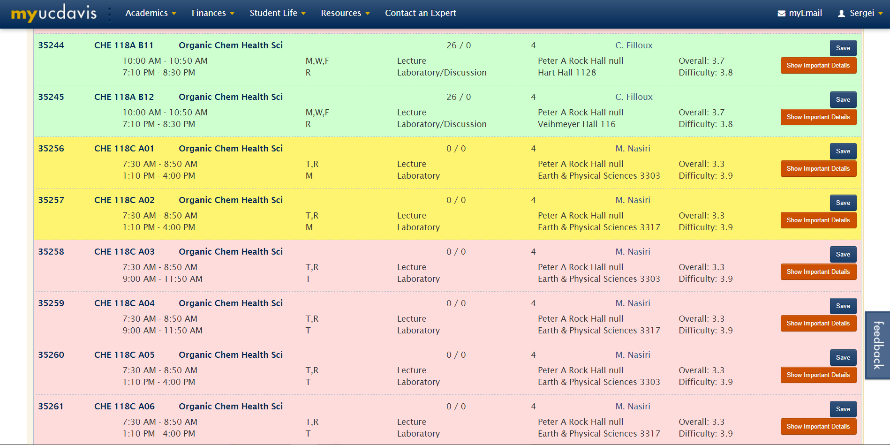
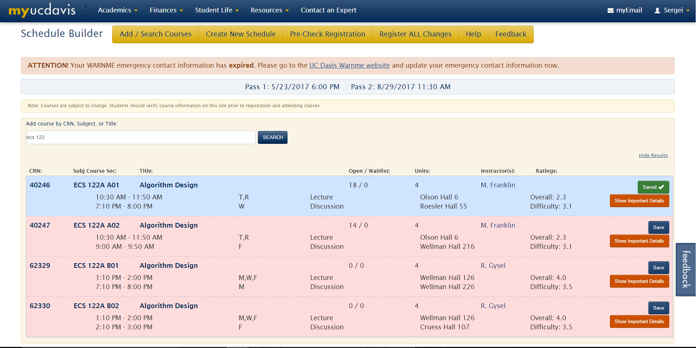
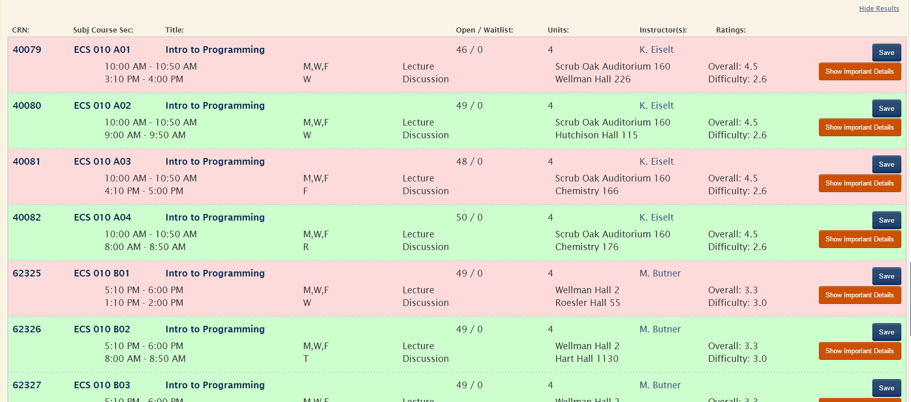
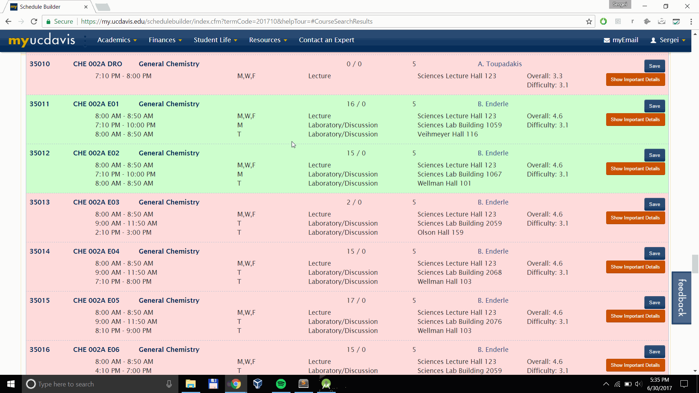

# ScheduleHelper
Chrome extension for UC Davis students that simplifies building your schedule by finding potential conflicts ahead of time and color coding classes that fit into your schedule and those that don't.
Conveniently displays the ratings of each professor with a direct link to their rate my professor page.

## Features:

### Color Coding
* **Blue** - Currently in your schedule
* **Red** - Conflicts with one of your classes
* **Yellow** - Does not conflict, but is full
* **Green** - Fits in your schedule

### Data from Rate My Professor
Rate my professor is a website seemingly *every* student has pulled up when deciding on their schedule for the next quarter.
With Schedule Helper, you no longer need to keep switching back and forth between tabs and searching up the professor of each class you consider,
their ratings are right there next to their name. Better yet, their name now links directly to their rate my professor page!

### Conflict information
In addition to marking conflicting classes as red, Schedule Helper tells you which one of your selected classes they conflict with.
Simply hover over the name of the class to see!

## Screenshots:

#### Without Schedule Helper:

#### With Schedule Helper:

## How to install

Schedule Helper will be available for download on the Chrome Extension Store when it is released.
